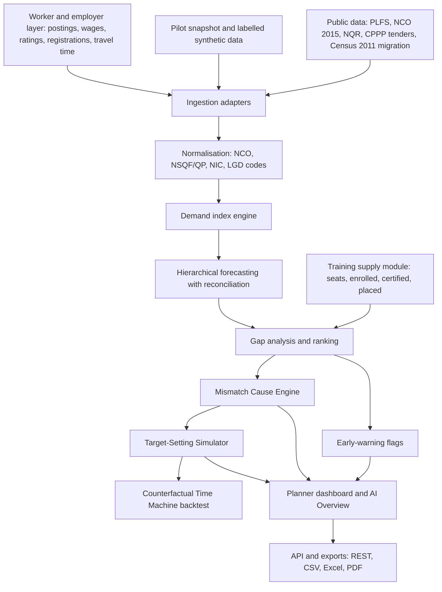

# Labour Market Intelligence and Skill Demand-Supply Forecasting Engine

A planning tool for MSDE, NCVET and Sector Skill Councils that forecasts skill demand-supply gaps by trade and district, explains why each gap exists and tests what a fix would do before anyone acts on it.

> Status: this repo is at the design stage. Right now it holds our planning document ([OVERVIEW.md](OVERVIEW.md)) and this README. No application code has been committed yet, so every feature below is marked Planned. We'll update the status columns as modules land.

## SIH details

| Field | Value |
|---|---|
| Hackathon | Smart India Hackathon (SIH) 2026 |
| Problem Statement ID | SIH26246 |
| Title | AI-Enabled Labour Market Intelligence and Skill Demand-Supply Forecasting Engine |
| Ministry | Ministry of Skill Development and Entrepreneurship (MSDE) |
| Problem creator | Sarim Moin, Ministry of Education's Innovation Cell (MIC) |
| Category | Software |
| Technology bucket | Miscellaneous |
| Team name | Team Aeris |
| Team ID | 175950 |

## Team members

- Vansh Bahl
- Vinayak Gupta
- Arshdeep Singh
- Kanishka Narang
- Avinash Kumar
- Ishant Thakral

## Problem statement

India trains lakhs of candidates every year, but the number of seats in each trade doesn't line up with what employers in each district actually need. Some trades keep producing more certified candidates than there are jobs. Newer trades don't get enough.

The data that could show this is spread across PLFS, NCO-coded job postings, industry hiring signals and e-Shram, and nobody pulls it together for planners. So a mismatch usually shows up only after placement numbers come in. By then it's too late to change annual targets, revise NSQF courses or resize a training centre.

## Our solution

Most approaches stop at "here's a heatmap of shortages". We want to close the loop:

```
Signal -> Forecast -> Diagnosis -> Intervention -> Validation
```

The system shouldn't just say "shortage in district X". It should say why the gap exists (skills, geography, wages, eligibility, timing or weak evidence), what to do about it, what happens if the planner does it, and back that up by replaying past years.

There's also a thin worker and employer layer (job matching, ratings, protection). It isn't a separate product. Its job is to produce live labour signals, like posted wages, employer trust and registered workers by trade, that feed into the planner dashboard.

## Key features

Status key: Done, In progress, Planned. Since there's no code in the repo yet, everything is Planned for now.

### Core modules

| Module | What it does | Status |
|---|---|---|
| Data ingestion | Adapters for job portals, PLFS, e-Shram, NCS, training data (CSV, API, scraper), with a scheduler | Planned |
| Normalisation and taxonomy | Maps job titles to NCO-2015, trades to NSQF/QP, industries to NIC, districts to LGD codes. Handles Hindi and regional job titles, dedup | Planned |
| Demand index engine | One score per trade and district from many sources, using source weights, recency decay and a confidence score | Planned |
| Training supply module | Centre capacity, seat allocation, enrolled, certified and placed counts by trade, district and scheme | Planned |
| Forecasting engine | Hierarchical forecasts (national, state, district, trade) with reconciliation and prediction intervals | Planned |
| Gap analysis and ranking | Demand minus supply, ranked by severity of oversupply or undersupply | Planned |
| Early-warning system | Saturation and shortage thresholds, trend-break detection, alert feed | Planned |
| Interactive dashboard | Choropleth map, national to district drill-down, trade filters, time slider | Planned |
| API and export layer | REST API, CSV, Excel and PDF exports | Planned |
| Multilingual and accessibility | Hindi plus regional languages, WCAG 2.1 AA, low-bandwidth mode | Planned |
| Admin and governance | Role-based access, audit logs, data-quality and model monitoring | Planned |
| Methodology documentation | Data lineage, index formula, model cards, assumptions | Planned |

### Essentials

| Feature | What it does | Status |
|---|---|---|
| AI Overview | Plain-language summary at each drill level. The LLM only narrates numbers the pipeline computed, and each sentence links to its evidence | Planned |
| Proximity job matching | Jobs ranked by travel time, not straight-line distance, with net wage after commute cost | Planned |
| Two-sided ratings | Workers and employers rate each other, only after a verified job completion | Planned |
| Abuse and scam protection | See protection measures below | Planned |
| Fair-wage benchmark | Each posting compared with the state minimum wage and the market median for that trade and district | Planned |
| Multilingual voice onboarding | Workers register by speaking in Hindi or a regional language. We plan to reuse this from our earlier project, KisanLink | Planned |
| Verified profiles | Phone OTP, optional e-Shram link, employer verification through Udyam or GSTIN | Planned |
| SMS and WhatsApp alerts | Match alerts, pay due reminders, grievance status | Planned |

Worker ranking won't use ratings alone, since new workers would never get picked and rating bias is real. The planned match score is:

```
match score = skill fit + travel time + Bayesian-smoothed rating + availability
```

New workers get a boost, ratings need a minimum review count before they count fully, and the weights are configurable by state or planner.

Planned protection measures:

- Minimum-wage check on every posting (block or flag below the floor)
- Ratings only from verified jobs, with a dispute option for workers
- Unpaid-wage tracking, where both sides confirm payment and overdue payments trigger escalation
- Classifier for "pay to apply" placement-fee scams, plus a report button
- Ghost-posting prevention through dedup, employer verification and posting expiry
- Unsafe or night-work flags with an SOS contact
- Age gate and flags on hazardous-trade postings
- AI explanation of each job offer in the worker's language before they accept
- Grievances routed to the state labour department, with status tracking
- DPDP Act 2023 consent, minimal data collection and no Aadhaar storage

### USPs

Listed in our priority order.

| # | USP | What it does | Status |
|---|---|---|---|
| 1 | Mismatch Cause Engine | Rule-based diagnosis of each gap: skill, mobility, eligibility, wage, timing, genuine shortage or uncertain. Sometimes the answer is "don't add seats" | Planned |
| 2 | Counterfactual Time Machine | Backtests past years to show which seat decisions would have changed if planners had used the system | Planned |
| 3 | Target-Setting Simulator | Cut or add seats in a trade and district, see how the forecast gap moves | Planned |
| 4 | SkillBridge | Reskilling path graph from surplus trades to shortage trades, with reusable skills and missing modules | Planned |
| 5 | Curriculum Drift Detector | Compares skills employers ask for against what the qualification teaches | Planned |
| 6 | Vacancy Reality Filter, Wage-Pressure Validator, Forecast Evidence Ledger | Dedups inflated vacancy counts, checks whether wages actually rise where "shortages" are claimed, and records why each forecast changed | Planned |
| 7 | Pipeline-adjusted supply, explainable flags, per-cell confidence, hierarchical reconciliation | Counts current trainees as future supply, gives a reason for every flag, grades every number, keeps district forecasts consistent with state and national totals | Planned |
| 8 | Pre-Vacancy Demand Radar | Reads public tenders (CPPP) to spot demand before postings appear. Demo grade only | Planned |
| 9 | Labour-shed catchments, natural-language and voice query, auto policy brief PDF | Commuting-based labour markets, questions in Hindi or regional languages, one-click state brief | Planned |

Stretch goals we'll only attempt if we're ahead of schedule: Centre Reconfiguration, Eligibility Bottleneck Detector, Centre Sanction Optimiser. Hidden-Demand Correction, Analog District forecasting and the Skill Volatility Index are cut for now because they need data we won't have.

## System architecture

This is the planned data flow. None of it is built yet.



## Tech stack

Not finalised yet. There are no package files, configs or source folders in the repo, so we're not listing a framework or database we haven't actually picked. The planning doc only names a few specific tools:

| Purpose | Candidate (from OVERVIEW.md) | Status |
|---|---|---|
| Travel-time routing for job matching | OSRM or a Distance Matrix API | Not decided |
| Voice onboarding and i18n | Reused from our KisanLink project | Not yet brought into this repo |
| Seat optimisation (stretch goal) | OR-Tools | Cut unless ahead of schedule |

This table will be replaced with the real stack once the code is in.

## Data sources and methodology

We don't have access to live NCS or e-Shram feeds. The pilot will run on:

- NCO 2015 occupation codes
- National Qualifications Register (qualification titles, NSQF levels, durations)
- PLFS releases (monthly all-India and quarterly State/UT estimates, not district-level real time)
- Census 2011 migration tables, used only as a structural prior for commuting and migration, not as a live signal
- CPPP public tenders and awards, for the demand radar
- A reproducible pilot snapshot, extended with clearly labelled synthetic data where real data is missing

Every value will carry a provenance tag: `observed`, `estimated`, `synthetic` or `modelled`. Worker and employer volumes in the demo will be simulated.

The demand index combines these sources into one score per trade and district. The plan is to weight each source by reliability, decay older signals, normalise for volume differences between sources, and attach a confidence score so a thin-evidence cell doesn't look as solid as a well-covered one.

A full methodology document (index formula, data lineage, model cards, limitations) is part of the deliverables but hasn't been written yet. Until then, [OVERVIEW.md](OVERVIEW.md) has the full feature catalogue and data strategy.

Pilot States and sectors: to be finalised. The planning doc suggests Haryana and Uttar Pradesh, with manufacturing and construction, but that isn't locked in.

## Project structure

Current contents:

```
.
├── OVERVIEW.md   Planning document: modules, essentials, USP catalogue, data strategy, team split
└── README.md     This file
```

We'll add the source tree here once the first modules are committed.

## Getting started

There's nothing to install or run yet. Once code is committed this section will cover prerequisites, environment variables and run commands taken from the actual project files.

For now you can clone the repo and read the plan:

```bash
git clone TODO-repo-url
```

## API overview

No endpoints exist yet. The plan is a REST API that exposes gap forecasts, rankings and early-warning flags by sector, trade and district, plus CSV, Excel and PDF exports for scheme target-setting. Endpoints will be documented here as they're built.

## Multilingual and accessibility

Planned, not built:

- Hindi plus a few regional languages (which ones is still open), using i18n keys from the start instead of retrofitting later
- Voice onboarding for workers and voice or natural-language queries for planners
- WCAG 2.1 AA target: keyboard navigation, screen-reader support, sufficient contrast
- Low-bandwidth mode for state planning units on weak connections
- Job offers explained to workers in their own language, by voice and text

## Limitations and assumptions

- There's no working code yet. Everything in this README describes what we plan to build.
- We don't have real NCS or e-Shram data. Forecasts in the demo will rest on public datasets plus synthetic data, and will be labelled that way.
- Worker and employer numbers in the demo are simulated. They show how the signals would flow, not real usage.
- Census migration data is from 2011, so it's only a rough prior for commuting patterns.
- PLFS isn't available at district level in real time, so district-level estimates will be modelled.
- Any example numbers in our planning doc (like shortage counts in the USP descriptions) are illustrative, not outputs of a model.
- We won't report forecast accuracy until we've actually backtested. Forecasts will come with prediction intervals and a confidence grade rather than a single number.
- We assume voice onboarding and i18n can be reused from KisanLink with modest changes.

## Roadmap

Rough order, based on our build priority:

1. Data pipeline, taxonomy mapping and synthetic pilot data
2. Demand index, training supply module and hierarchical forecasts
3. Gap ranking, early warnings and the planner dashboard with drill-down
4. Worker and employer essentials (matching, ratings, fair-wage checks, protection rules)
5. Mismatch Cause Engine
6. Counterfactual Time Machine and Target-Setting Simulator
7. SkillBridge and Curriculum Drift Detector
8. Vacancy Reality Filter, Wage-Pressure Validator, Forecast Evidence Ledger, confidence scores
9. If time allows: demand radar from tenders, labour-shed catchments, voice query, policy brief PDF
10. Methodology document, demo and pitch

## Demo and links

| Item | Link |
|---|---|
| Demo video | TODO |
| Deployed app | TODO |
| Presentation | TODO |
| Methodology document | TODO |
| Screenshots | TODO |

## License

No license file has been added yet.
